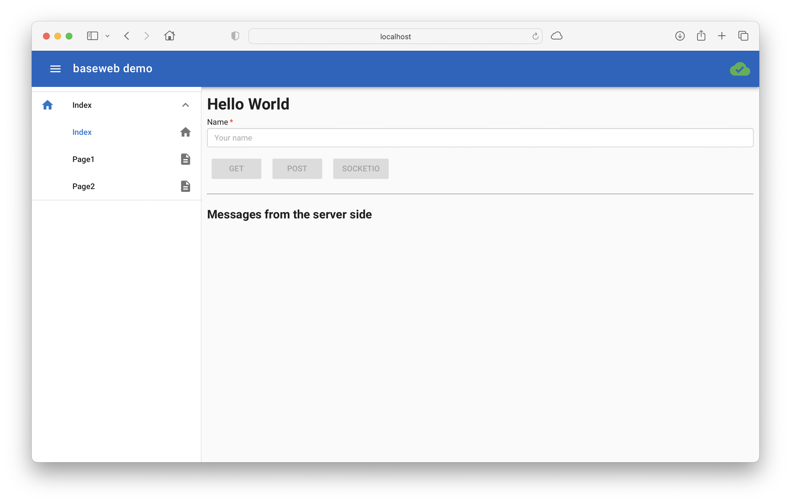

# baseweb demo

This repository is a demo application for [baseweb](https://github.com/christophevg/baseweb), showcasing its features and demonstrating best practices for building async web applications with Quart.

## Features Demonstrated

- **REST API**: GET and POST endpoints with different response types
- **Authentication**: Custom authenticator with scope-based access control
- **OAuth Integration**: Protected endpoints using OAuth (optional)
- **Vue.js Frontend**: Vuetify-based UI with Vue Form Generator
- **PWA Support**: Progressive Web App configuration
- **Component Registration**: Modular page and component structure

## Requirements

- Python 3.11+
- [uv](https://docs.astral.sh/uv/) package manager

## Quick Start

Clone and run:

```console
% git clone https://github.com/christophevg/baseweb-demo
% cd baseweb-demo
% uv sync --all-extras
% make run
```

Visit [http://localhost:8000](http://localhost:8000).



## Running the Demo

### Production (gunicorn + uvicorn)

```console
% make run
# or
% uv run gunicorn "app:asgi_app" -w 1 -k uvicorn.workers.UvicornWorker --bind 0.0.0.0:8000
```

**Note:** Use `app:asgi_app` (not `app:server`) to enable both REST API and WebSocket/Socket.IO.

### Development (with auto-reload)

```console
% make run-dev
# or
% uv run uvicorn "app:asgi_app" --reload --host 0.0.0.0 --port 8000
```

## Development

```console
% make install   # Install dependencies
% make lint      # Run linter
% make test      # Run tests
% make coverage  # Run tests with coverage
```

## API Patterns

The demo showcases two response patterns:

### Plain Text Response (GET)

```python
class Hello(Resource):
    async def get(self):
        return f"Hello {name} from REST/GET"  # Plain string
```

Frontend receives the string directly.

### JSON Response (POST)

```python
class Hello(Resource):
    async def post(self):
        return {"message": f"Hello {name} from REST/POST"}  # JSON object
```

Frontend unpacks: `response.message`

This demonstrates that:
- **Dicts** are auto-converted to JSON with `application/json` content-type
- **Strings** are returned as-is (framework determines content-type)

## Project Structure

```
baseweb-demo/
├── app/                        # Application code
│   ├── __init__.py             # Main entry point, server configuration
│   ├── pages/                  # Page modules (routes + Vue components)
│   │   ├── index/              # Hello World with REST API
│   │   ├── protected_page/     # OAuth-protected page
│   │   ├── components/         # Reusable Vue components
│   │   └── page1-7/            # Additional demo pages
│   ├── components/             # Shared Vue components
│   └── static/                 # Static files (CSS, images, icons)
├── tests/                      # Test suite
├── pyproject.toml              # Project configuration
├── Makefile                    # Development commands
└── .env                        # Environment configuration
```

## Running Against Local Baseweb

To develop against a local baseweb checkout:

```console
% cd baseweb-demo
% uv add --editable ../baseweb
% uv sync
```

The `pyproject.toml` already includes this configuration:

```toml
[tool.uv.sources]
baseweb = { path = "../baseweb", editable = true }
```

## Environment Variables

Configure in `.env`:

| Variable | Description | Default |
|----------|-------------|---------|
| `LOG_LEVEL` | Logging level | `INFO` |
| `APP_NAME` | Application name | `baseweb demo` |
| `APP_URL` | Application URL | - |
| `APP_STYLE` | Style mode (`web` or `pwa`) | `pwa` |
| `OAUTH_PROVIDER` | OAuth provider (optional) | - |
| `OAUTH_CLIENT_ID` | OAuth client ID (optional) | - |

## Migration from Flask

This demo was migrated from Flask to Quart for async support. Key changes:

| Before | After |
|--------|-------|
| `from flask import ...` | `from quart import ...` |
| `from flask_restful import Resource` | `from baseweb import Resource` |
| `def get(self):` | `async def get(self):` |
| `server.api.add_resource(...)` | `server.add_resource(...)` |
| `gunicorn -k eventlet` | `gunicorn -k uvicorn.workers.UvicornWorker` |

See the [baseweb migration guide](https://github.com/christophevg/baseweb/blob/master/docs/migration-guide.md) for details.

## Known Limitations

- **SocketIO**: Disabled pending WebSocket migration in baseweb
- **OAuth**: Requires `OAUTH_PROVIDER` and `OAUTH_CLIENT_ID` environment variables

## License

MIT License - See [LICENSE](LICENSE) for details.