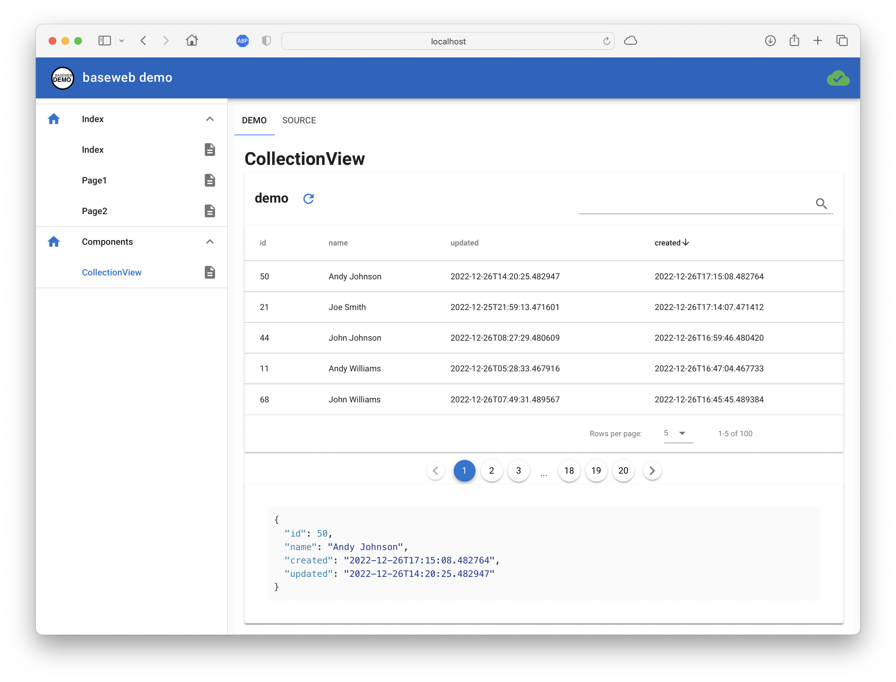

# baseweb demo

This repository is a small demo application for baseweb. See [https://github.com/christophevg/baseweb](https://github.com/christophevg/baseweb)  for more information on baseweb.

## Running the Demo

First prepare a suitable execution environment, with your favorite virtual environment runner - mine is PyEnv:

```console
% mkdir baseweb-demo
% cd baseweb-demo
% pyenv virtualenv baseweb-demo
% pyenv local baseweb-demo
```

Next clone the baseweb-demo repository, install the minimal requirements (baseweb and gunicorn + eventlet to run it) and run the demo...

```console
% git clone https://github.com/christophevg/baseweb-demo
% cat baseweb-demo/requirements.txt 
baseweb==0.0.8
eventlet==0.33.2
gunicorn @ https://github.com/benoitc/gunicorn/archive/ff58e0c6da83d5520916bc4cc109a529258d76e1.zip
% pip install -r baseweb-demo/requirements.txt
% gunicorn -k eventlet -w 1 baseweb-demo:server
```

Now visit [http://localhost:8000](http://localhost:8000).


